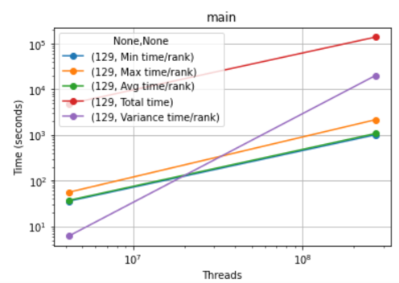
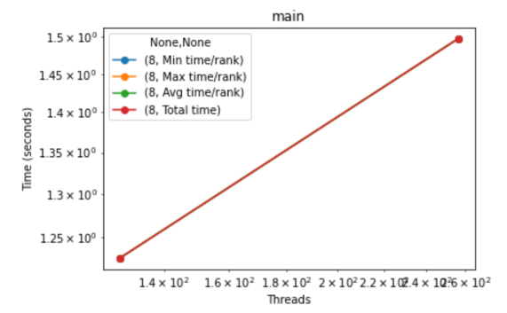
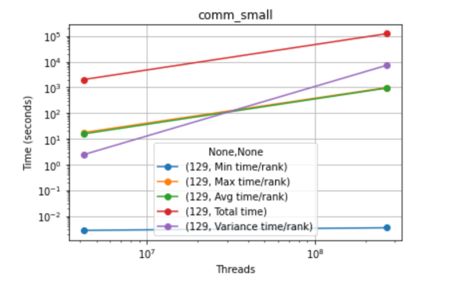
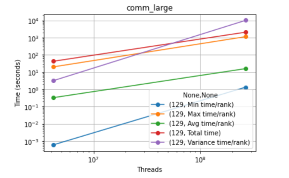

Due to time restraints, especially with the GPU cluster having issues during this week, I was not able to obtain high data count files for the CUDA implementation.

For both algorithmic implementations, it is pretty clear that there is a linear relationship between the amount of threads and the time it takes to run. This is especially evident in the MPI implementation, where higher data counts were able to be provided. One significant feature displayed in these graphs is that the max time/rank number is very close to the total time number, indicating that there are certain ranks that are contributing the majority of the time. This makes sense, as in a merge sort, the lower ranks of the merge tree take very little time, as merging sorted lists is a small operation that gets exponentially bigger in time as the size increases. If I could hazard a guess, it would be that the rank that had the maximum time was the rank that was processing the final merge back to the full array size.

One other important thing to notice within the data is that comm_small took significantly more time than comm_large. The way the regions are annotated is such that each individual send or receive is marked individually. If the times per rank are summed together, I would assume this is because I perform at least twice as many small communications as large communications, which would imply that regardless of how large the packet is, the main overhead for communication comes from the call itself, not the data it is passing, at least at the scale that we are working at.
